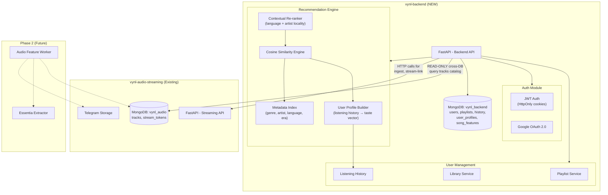

# VYNL Backend — Recommendation Engine System Design (FINAL)

> **Status:** Approved. All decisions finalized.

## Decisions Summary

| Decision | Choice | Notes |
|----------|--------|-------|
| Auth provider | Google OAuth only | No email/password, no Apple |
| Onboarding | Min 3, max 10 genres/artists | Users must pick at least 3 |
| MongoDB | Same Atlas cluster, separate DB (`vynl_backend`) | Read-only cross-DB access to `vynl_audio.tracks` |
| Service communication | **Hybrid**: read `tracks` directly from DB, writes via HTTP API | Best balance of performance and decoupling |
| Platform | Web-first | HttpOnly cookies for refresh tokens, shorter access token TTL |
| Recommendation locality | Same language priority + nearby artist clustering | Weighted in scoring function |

---

## The Core Problem

Songs enter the system dynamically via `POST /ingest` (from `vynl-audio-streaming`). There's no static dataset. The recommendation engine must work the moment a song is ingested, using only **metadata from iTunes** (genre, artist, album, year, language).

**Phase 1 (now):** Metadata-based content filtering with user taste profiles.  
**Phase 2 (later):** Background audio feature extraction via Essentia for deeper sonic similarity.

---

## System Architecture



---

## Service Communication Pattern

```
┌─────────────────────┐         ┌──────────────────────┐
│   vynl-backend      │         │ vynl-audio-streaming  │
│   (vynl_backend DB) │         │ (vynl_audio DB)       │
│                     │         │                       │
│  READS directly ────┼────────►│  tracks collection    │
│  from vynl_audio    │  (same  │  (read-only access)   │
│  .tracks collection │ cluster)│                       │
│                     │         │                       │
│  WRITES go via ─────┼──HTTP──►│  POST /ingest         │
│  HTTP API calls     │         │  GET /stream-link     │
│                     │         │  GET /search          │
└─────────────────────┘         └──────────────────────┘
```

**Why this pattern:**
- Recommendation engine needs full catalog scans — HTTP would cause N+1 queries
- Writes remain through the owning service's API (single source of truth)
- Both DBs live on the same Atlas cluster — cross-DB reads are free and fast

---

## Recommendation Algorithm

### Song Feature Vector (stored in `song_features`)

```python
song_features = {
    "track_id": "uuid",
    
    # From iTunes metadata (available immediately on ingest)
    "genre": "pop",
    "sub_genres": ["synth-pop", "dance-pop"],
    "artist_id": "artist-uuid",
    "artist_name": "The Weeknd",
    "album": "After Hours",
    "release_year": 2020,
    "explicit": True,
    "duration_ms": 210000,
    "language": "en",              # CRITICAL: extracted from iTunes locale/metadata
    
    # Derived on ingest
    "artist_cluster": 14,          # similar-artist group ID
    "era": "2020s",
    "popularity_score": 0.0,
    
    # Phase 2 (null until background worker runs)
    "audio_features": None,
    "features_extracted_at": None,
    
    "created_at": "datetime"
}
```

### User Taste Profile

```python
user_profile = {
    "user_id": "uuid",
    
    "genre_weights": {
        "pop": 0.35,
        "hip-hop": 0.25,
        "r&b": 0.20
    },
    
    "top_artists": ["artist-id-1", "artist-id-2"],
    
    "language_weights": {           # NEW: language affinity
        "en": 0.6,
        "hi": 0.3,
        "es": 0.1
    },
    
    "era_weights": {
        "2020s": 0.5,
        "2010s": 0.3
    },
    
    # Artist locality graph: artists the user listens to form a cluster.
    # Recommendations prioritize songs from artists "near" this cluster.
    "artist_cluster_ids": [14, 7, 22],
    
    "total_plays": 342,
    "avg_completion_rate": 0.78,
    "last_updated": "datetime"
}
```

### Behavioral Signal Weights

| Signal | Weight | Rationale |
|--------|--------|-----------|
| Full listen (>80% completion) | +1.0 | Strong positive |
| Partial listen (30-80%) | +0.3 | Mild interest |
| Skip (<30%) | -0.5 | Negative signal |
| Add to playlist | +1.5 | Strongest positive |
| Like/heart | +1.2 | Explicit positive |
| Repeat play (same session) | +0.8 | Clear affinity |

### Scoring Function

```
score(user, song) = (
    0.30 * genre_match(user.genre_weights, song.genre)
  + 0.20 * language_match(user.language_weights, song.language)   # LANGUAGE PRIORITY
  + 0.20 * artist_locality(user.artist_cluster_ids, song.artist_cluster)  # NEARBY ARTISTS
  + 0.10 * era_match(user.era_weights, song.era)
  + 0.10 * popularity_score(song)
  + 0.10 * recency_boost(song)
)
```

**Language matching logic:**
- If user has 60% English, 30% Hindi → songs in those languages score proportionally
- Songs in a language the user has NEVER listened to get a 0.05 floor (exploration)
- This naturally keeps recommendations in the user's preferred languages

**Artist locality logic:**
- Artists are clustered by genre + collaboration + co-listening patterns
- If user likes The Weeknd (cluster 14), songs from Doja Cat (also cluster 14) score high
- Songs from completely unrelated clusters (e.g., heavy metal cluster 3) score low
- Built using a simple pre-computed artist similarity graph

### Diversification Rules

1. Max 2 songs per artist in a single recommendation batch
2. At least 2 languages represented (if user has multi-language history)
3. 20% exploration slots — random picks from low-weight genres/artists
4. No song repeated within 7 days of last play

### Cold Start Handling

| Scenario | Solution |
|----------|----------|
| **New user** | Onboarding: pick 3-10 genres/artists → seed taste profile |
| **New song** | Metadata similarity works immediately — no interaction data needed |
| **<10 plays** | 50% personalized + 50% trending/popular |

---

## Tech Stack

| Component | Choice | Why |
|-----------|--------|-----|
| **Framework** | FastAPI (Python 3.11+) | Matches streaming service. Async. |
| **Database** | MongoDB Atlas (same cluster, `vynl_backend` DB) | Already running. |
| **Auth** | Google OAuth 2.0 + JWT | Web-first, HttpOnly refresh cookies |
| **Password hashing** | N/A (Google OAuth only) | No passwords to store |
| **Similarity** | scikit-learn + numpy | Cosine similarity, lightweight |
| **HTTP client** | httpx (async) | For calls to streaming service |
| **Validation** | Pydantic v2 | Request/response models |
| **Audio features (Phase 2)** | Essentia | Background worker, not on hot path |

### JWT Strategy (Web-First)

```
Access Token:  15 min TTL, sent in Authorization header
Refresh Token: 7 day TTL, HttpOnly secure cookie
               (NOT in localStorage — XSS protection)

Flow:
1. User logs in via Google OAuth
2. Backend exchanges code for Google tokens
3. Backend creates/finds user in DB
4. Returns: access_token (body) + refresh_token (Set-Cookie)
5. Frontend stores access_token in memory (NOT localStorage)
6. On 401: frontend calls /auth/refresh (cookie auto-sent)
```

---

## MongoDB Collections

### `vynl_backend.users`
```json
{
  "_id": "ObjectId",
  "user_id": "uuid-v4",
  "email": "user@gmail.com",
  "username": "display_name",
  "avatar_url": "google-profile-pic-url",
  "auth_provider": "google",
  "google_sub": "google-unique-id",
  "onboarding_complete": false,
  "created_at": "datetime",
  "updated_at": "datetime"
}
```

### `vynl_backend.user_profiles`
```json
{
  "_id": "ObjectId",
  "user_id": "uuid-v4",
  "genre_weights": { "pop": 0.35 },
  "language_weights": { "en": 0.6, "hi": 0.3 },
  "top_artists": ["artist-id-1"],
  "artist_cluster_ids": [14, 7],
  "era_weights": { "2020s": 0.5 },
  "total_plays": 342,
  "avg_completion_rate": 0.78,
  "last_updated": "datetime"
}
```

### `vynl_backend.listening_history`
```json
{
  "_id": "ObjectId",
  "user_id": "uuid-v4",
  "track_id": "uuid-v4",
  "played_at": "datetime",
  "duration_listened_ms": 180000,
  "total_duration_ms": 210000,
  "completion_rate": 0.857,
  "source": "recommendation|search|playlist",
  "action": "full_play|skip|repeat"
}
```

### `vynl_backend.playlists`
```json
{
  "_id": "ObjectId",
  "playlist_id": "uuid-v4",
  "user_id": "uuid-v4",
  "name": "My Playlist",
  "description": "...",
  "cover_url": "...",
  "is_public": false,
  "tracks": [
    { "track_id": "uuid-v4", "added_at": "datetime", "position": 0 }
  ],
  "created_at": "datetime",
  "updated_at": "datetime"
}
```

### `vynl_backend.song_features`
```json
{
  "_id": "ObjectId",
  "track_id": "uuid-v4",
  "genre": "pop",
  "sub_genres": ["synth-pop"],
  "artist_id": "artist-uuid",
  "artist_name": "The Weeknd",
  "language": "en",
  "release_year": 2020,
  "era": "2020s",
  "explicit": true,
  "artist_cluster": 14,
  "popularity_score": 0.0,
  "play_count": 0,
  "audio_features": null,
  "features_extracted_at": null,
  "created_at": "datetime"
}
```

### `vynl_backend.liked_songs`
```json
{
  "_id": "ObjectId",
  "user_id": "uuid-v4",
  "track_id": "uuid-v4",
  "liked_at": "datetime"
}
```

---

## API Endpoints

### Auth (Google OAuth Only)
| Method | Path | Description |
|--------|------|-------------|
| `GET`  | `/api/v1/auth/google/login` | Redirect to Google consent screen |
| `GET`  | `/api/v1/auth/google/callback` | Handle OAuth callback → JWT |
| `POST` | `/api/v1/auth/refresh` | Refresh access token (uses HttpOnly cookie) |
| `POST` | `/api/v1/auth/logout` | Clear refresh cookie |
| `GET`  | `/api/v1/auth/me` | Get current user |

### Onboarding
| Method | Path | Description |
|--------|------|-------------|
| `GET`  | `/api/v1/onboarding/genres` | Available genres (curated list) |
| `GET`  | `/api/v1/onboarding/artists?genre=pop` | Suggest artists by genre |
| `POST` | `/api/v1/onboarding/preferences` | Submit 3-10 genres/artists |

### Library
| Method | Path | Description |
|--------|------|-------------|
| `GET`    | `/api/v1/library/liked` | User's liked songs (paginated) |
| `POST`   | `/api/v1/library/like/{track_id}` | Like a song |
| `DELETE`  | `/api/v1/library/like/{track_id}` | Unlike |
| `GET`    | `/api/v1/library/recent` | Recently played |

### Playlists
| Method | Path | Description |
|--------|------|-------------|
| `GET`    | `/api/v1/playlists` | List user's playlists |
| `POST`   | `/api/v1/playlists` | Create playlist |
| `GET`    | `/api/v1/playlists/{id}` | Get playlist + tracks |
| `PUT`    | `/api/v1/playlists/{id}` | Update metadata |
| `DELETE`  | `/api/v1/playlists/{id}` | Delete playlist |
| `POST`   | `/api/v1/playlists/{id}/tracks` | Add track |
| `DELETE`  | `/api/v1/playlists/{id}/tracks/{track_id}` | Remove track |
| `PUT`    | `/api/v1/playlists/{id}/tracks/reorder` | Reorder tracks |

### Recommendations
| Method | Path | Description |
|--------|------|-------------|
| `GET`  | `/api/v1/recommendations/for-you` | Personalized feed |
| `GET`  | `/api/v1/recommendations/similar/{track_id}` | "More like this" |
| `GET`  | `/api/v1/recommendations/trending` | Global trending |
| `GET`  | `/api/v1/recommendations/new-releases` | Recently added songs |

### History
| Method | Path | Description |
|--------|------|-------------|
| `POST` | `/api/v1/history/play` | Record play event |
| `GET`  | `/api/v1/history/recent` | Recent history (paginated) |

---

## Project Structure

```
vynl-backend/
├── CONTEXT.md
├── PLAN.md
├── README.md
├── requirements.txt
├── .env
├── .env.example
├── .gitignore
├── app/
│   ├── __init__.py
│   ├── main.py
│   ├── config.py
│   ├── exceptions.py
│   ├── dependencies.py          # Auth dependency injection
│   ├── api/
│   │   ├── __init__.py
│   │   ├── auth.py              # Google OAuth + JWT
│   │   ├── onboarding.py
│   │   ├── library.py
│   │   ├── playlists.py
│   │   ├── recommendations.py
│   │   └── history.py
│   ├── db/
│   │   ├── __init__.py
│   │   └── mongo.py             # Motor client (both DBs)
│   ├── models/
│   │   ├── __init__.py
│   │   ├── user.py
│   │   ├── playlist.py
│   │   ├── history.py
│   │   └── recommendation.py
│   ├── services/
│   │   ├── __init__.py
│   │   ├── auth_service.py      # JWT creation, Google token exchange
│   │   ├── user_service.py      # User CRUD
│   │   ├── playlist_service.py
│   │   ├── library_service.py
│   │   ├── history_service.py
│   │   ├── profile_service.py   # Taste profile builder
│   │   ├── recommendation_engine.py  # The core engine
│   │   ├── feature_indexer.py   # Song feature extraction from metadata
│   │   └── streaming_client.py  # httpx client for vynl-audio-streaming
│   └── utils/
│       ├── __init__.py
│       ├── jwt_utils.py
│       └── similarity.py        # Cosine similarity helpers
```
