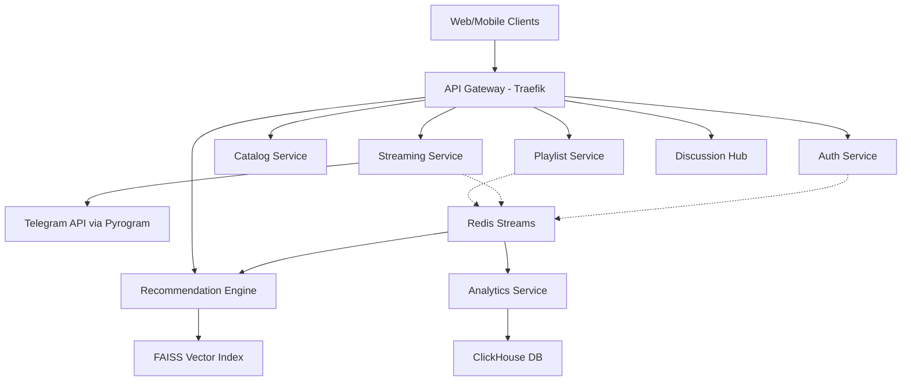

# System Architecture — VYNL

## 1. Overview
VYNL uses a **Microservices Architecture** designed for high availability and zero-cost infrastructure. The system is containerized using Docker and orchestrated via Docker Compose on a single Oracle Cloud VM.

## 2. Component Diagram

## 3. Core Architectural Patterns

### 3.1 Event-Driven Communication
- **Redis Streams** acts as the primary event bus.
- Services publish domain events (e.g., `track.played`, `user.liked`, `playlist.updated`).
- The **Recommendation Engine** and **Analytics Service** consume these streams asynchronously to update taste vectors and historical logs.

### 3.2 Real-time Collaboration (CRDT)
- The **Playlist Service** and **Discussion Hub** use WebSockets for real-time updates.
- **Ypy (CRDT)** ensures that concurrent edits to playlists are merged deterministically without requiring a central database lock during the edit session.

### 3.3 Zero-Cost Storage Strategy
- Audio files are stored in a private Telegram channel.
- The **Streaming Service** uses **Pyrogram** to proxy byte-range requests from the client to the Telegram API, effectively using Telegram as an infinite, free object store.
- **Cloudflare** acts as a CDN layer to cache frequent requests and reduce load on the origin server.

### 3.4 API Gateway (Traefik)
- Handles SSL termination via Let's Encrypt.
- Performs JWT validation for all incoming requests.
- Routes traffic to the appropriate microservice based on the path (e.g., `/api/v1/auth/*`).

## 4. Service Discovery & Networking
- Services communicate over a private Docker Compose network.
- Each service is identifiable by its container name (e.g., `http://auth-service:8000`).
- No internal services are exposed directly to the internet; all traffic must pass through the API Gateway.
